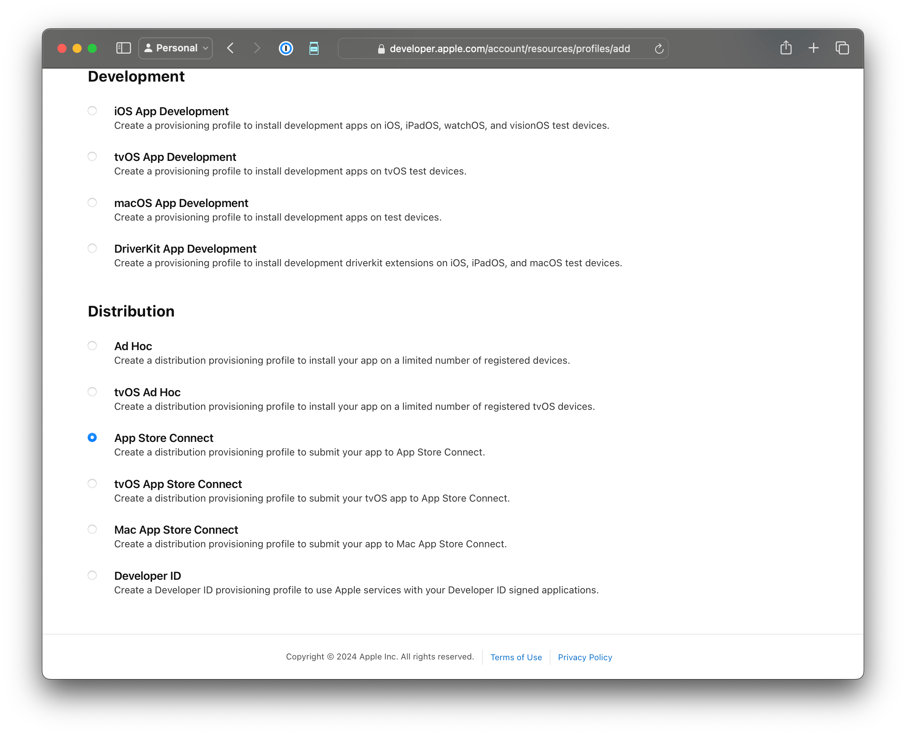
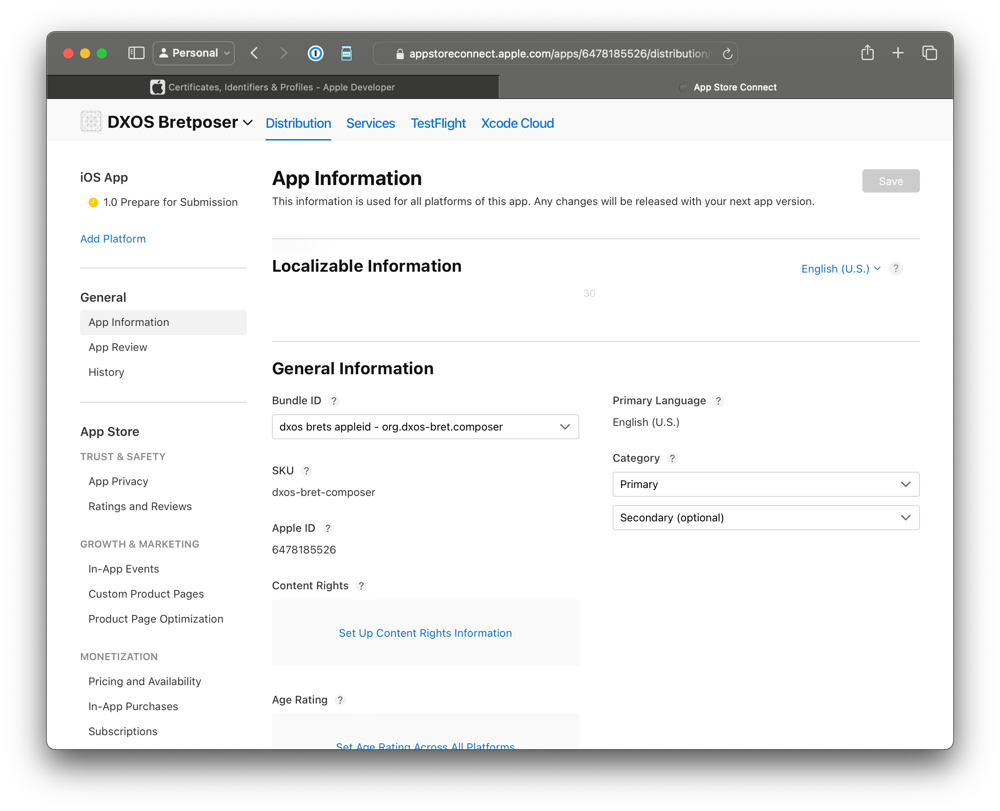
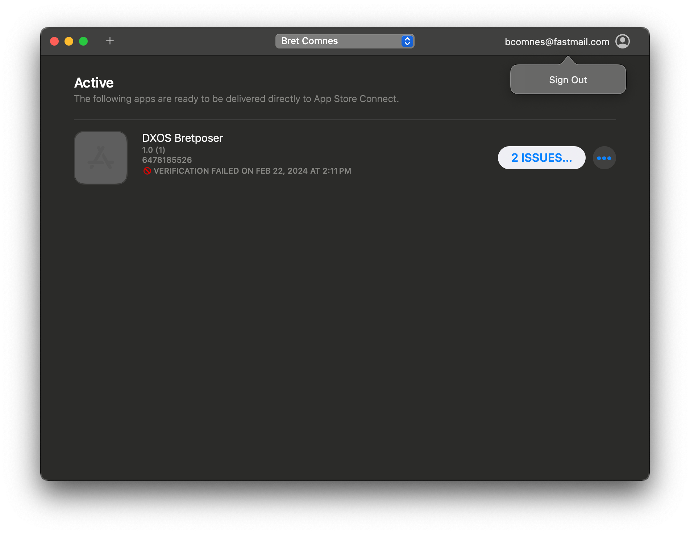

# iOS Build tutorial

There are two primary build targets when building iOS applications.

- Development
- Distribution (Production/Test Flight/App Store submission)

Below are brief tutorials and explanations on how to build iOS Socket runtime applications for each target.

## Development

To build an ssc app for iOS, you are required to set up a few things necessitated by apple.

- A working installation of XCode
- An apple developer account (or membership to an org account).
- A signing certificate.
- An app identifier.
- A iOS device in developer mode registered to the apple developer account
- A provisioning profile (a file generated on the apple developer account that combines the certificate, app identifier and registered device id into a single file used to build a runnable artifact on real hardware)

Lets step through each item on the list:

### Xcode

- Download and install Xcode: https://apps.apple.com/us/app/xcode/id497799835?mt=12
- Launch XCode to finish the installation
- Log into your Apple Developer account in XCode with your Apple ID
  
- Once installed, ensure that the "Command Line Tools" setting in the "Locations" tab in Xcode settings is set to XCode.
  

### Apple Developer Account

Create an apple developer account.

- https://developer.apple.com

It requires an apple ID which you then upgrade to a personal or organizational apple developer account. It costs $100/year. Organizational accounts require a DUNS number, which requires a legal entity and EIN number.

For organizational accounts, I recommend creating a new Apple ID to sign up with rather than getting a personal Apple ID tied up in the organizational account. Apple IDs can only be owner of a single developer account at a time. They required a phone number. Google voice numbers used to work, however if they don't you can utilize dual sim on your phone to get a cheap real cell phone number.

I recommend that anyone working on the iOS build have administrative access to the developer account otherwise it requires a lot of synchronization between people to generate and approve certificates, devices, and provisioning profiles. Alternatively, on can develop using a personal apple developer account (providing unburdened administrative access), and then build and distribute using the organizational developer account, at additional cost of a personal apple developer account.

Visit [the certificates page](https://developer.apple.com/account/resources/certificates/list) and take note of the `team_identifier` in the top right corner of the screen. Add this value to your `.sscrc` in your home folder or project folder or in the `socket.ini` file.

```ini
[settings.apple]
team_identifier = GV52DXHA2M # will be different than this
```

### Signing Certificate

Once you have access to an Apple Developer account, you need to generate a certificate and have apple sign it, and then install it into your keychain.

First, generate a certificate signing request.

- Open Keychain Access.app
  
- In the Keychain Access Menu Bar, click Keychain Access -> Certificate Assistant -> Request a Certificate from a Certificate Authority
  
- Set the name of the certificate, and also select "Save to disk" which will create a `CertificateSigningRequest.certSigningRequest` file wherever you save it.
  
  
  
- Visit the [certificates page](https://developer.apple.com/account/resources/certificates/list) in your apple developer account.
- Click the blue plus icon to add a certificate
  
- "Apple Development" certificates are recommended since this type of certificate works for code signing both macOS and iOS apps. Code Signing is required for many features to work including notification center notifications. iOS and macOS certificate also work, but only for their respective platform.
  
- Upload the `CertificateSigningRequest.certSigningRequest` file generated earlier.
  
- Download the generated certificate and open it. It will be installed into your system keychain without any feedback, but will show up in your keychain now.
  

You have created, signed and installed a development certificate onto your laptop.

Note: there are account limits to how many certificates you can add depending on account type. You can always re-download certificates if you lose it. Certificates shouldn't generally be shared, because if you ever have to remove someone from the org, you would have to re-generate new certificates to remove them from the org instead of just revoking their individual certificate.

Every developer creating development builds a signing certificate.

#### Add Signing Certificate ID to your .sscrc

Either in your home folder or in the project folder in, create a `.sscrc` file. If its created in the project, add it to the `.gitignore` patterns.

- In the console, run `security find-identity`
- Under `Valid identities only`, you will see a list of signing certificate, with the one you created at the end of the list.
- Copy the Certificate ID into the clip board
- Set the Certificate ID into your `.sscrc` file under `settings.ios.codesign_identity`

```ini
[settings.ios]
codesign_identity = C221D161B7CE9512344E7284BBAF966BE06B07E15
```

### App identifier

Identifiers are globally unique identifiers that identify your app.
This only needs to be done once on the Apple ID account that is generating your provisioning profile.

To create one, go to you apple developer account resources page and click on identifiers.

- Visit https://developer.apple.com/account/resources/identifiers/list
  
- Click the blue button to add a new identifier
- Select "App IDs"
  
- Select "App"
- Set the description and identifier fields.
  - If in the DXOS org account, use `org.dxos.composer`
  - If setting up a personal account use a different identifier (e.g. `org.dxos-bret.composer`) as to not occupy the desired namespace for the production application.
- Confirm the identifier and save it.

During builds, the `meta.bundle_identifier` key should match the identifier in your provisioning profile.

```ini
[meta]
application_protocol = "composer"
bundle_identifier = "org.dxos.composer"
```

If you are using a personal account during development, you can override `socket.ini` field by creating an uncommitted `.sscrc` file in the project or your home directory.

### iOS Device

You must register your development iOS device to the apple developer account you are creating provisioning profiles with.

- Enable developer mode on the iOS Device https://developer.apple.com/documentation/xcode/enabling-developer-mode-on-a-device
- Once developer mode is enabled, ensure the iOS device is connected to the development computer, and establish trust with the machine.
- Run the following terminal command
  ```console
    √ ~ % cfgutil list devices
    Type: iPhone14,3	ECID: 0x123C1901F2401E	UDID: 00008110-00123C1901F2401E Location: 0x110000 Name: tone-phone
  ```
  Note, you may need to install the [Apple Configurator](https://support.apple.com/apple-configurator) tool to get the `cfgutil` utility.
- Take note of the UDID
- Visit https://developer.apple.com/account/resources/devices/list
  
- Add a device
  
- Give it a name and paste in the UDID
- Save

The device has been added to the apple developer account

### Provisioning profile

Finally, we can create a provisioning profile

- Visit https://developer.apple.com/account/resources/profiles/list
- Choose "iOS App Development" under "Development" and click continue
  
- Choose the identifier we just created
  
- Disable offline support (causes the provisioning profile to last only for 7 days) unless you really want to test true offline support.
- Select the signing certificate you just created from the list. Click Next
  
- Select the devices you want to deploy on. Click next
  
- Give the provisioning profile a name. Click next
  
- Download the provisioning profile
  

You have generated an downloaded the provisioning profile. Next establish a location to store these on the development machine.

Example: `~/Developer/ssc/profiles/dxos_bret.mobileprovision`

In your `.sscrc` file, point it to the provisioning profile

```ini
[settings.ios]
codesign_identity = C221D161B7CE9530F4E7284BBAF966BE06B07E15
provisioning_profile = /Users/bret/Developer/ssc/profiles/dxos_bret.mobileprovisio
```

Additionally, you may need to create the following directory prior to signing applications.
If you have signed applications already, this may already be present. If it isn't, just create it.

```
mkdir -p ~/Library/MobileDevice/Provisioning Profiles
```

### Full `.sscrc` example

Here is a full example of an `.sscrc` file:

```ini
[settings.apple]
# Team team_identifier is the code in the top right of
# https://developer.apple.com/account/resources/certificates/list
team_identifier = MV52DXHA2M

[settings.ios]
# run `security find-identity` to list, after creating and installing a signing cert
codesign_identity = C221D161B7CE9530F4E7284BBAF966BE06B07E15
# Create here: https://developer.apple.com/account/resources/profiles/list
# Provisioning profile combines registered device and signing cert into a single file
provisioning_profile = /Users/bret/Developer/ssc/profiles/dxos_bret.mobileprovision
simulator_device = "iPhone 15"

[settings.mac]
# mac identifer can match iOS if you created an apple developer certificate
# They will be different if you created iOS or macOS certicates only
codesign_identity = C221D161B7CE9530F4E7284BBAF966BE06B07E15
# Provisioning profile not needed on macOS
```

### Building development iOS builds

- Build and run in the iOS simulator: `ssc build -r -o --platform ios-simulator`
- Build a apk iOS build: `ssc build -o -c -p --platform ios`
- Deploy the latest iOS apk to a connected device: `ssc install-app --platform=ios`
- Build and run a code signed macOS build: `ssc build -o -c -p -r`

## App Store / Test Flight Builds

Test flight builds and final app store builds have similar requirements as development builds, but a different type of signing certificate, and a different provisioning profile.

### Distribution Certificate

Follow the same procedure above for a development signing certificate, except choose "Apple Distribution Certificate" or "iOS Distribution Certificate".


Download and install the certificate into your keychain as before.

### Distribution Provisioning Profile

Create a provisioning profile following the procedure above except select "App Store Connect" in the "Distribution" section when generating the profile.



Download the profile and place it in a location on your computer that you can reference in your `.ssrc` file.

### Configure your .ssrc or socket.ini

Configure your .sscrc file or socket.ini to point to the new distribution certificate, the new provisioning profile and also set the "distribution_method" to "app-store" in the ios section.

```ini
[settings.ios]
distribution_method = "app-store"
codesign_identity = 25401B36BB105456E85E222FB6895438CE537458
provisioning_profile = /Users/bret/Developer/ssc/profiles/Bret_DXOS_Dist_PP.mobileprovision
```

### Build a production build

Run a production iOS Build:

```
ssc build -c -p --platform ios --prod
```

### App Store Connect

Create/configure your app on the App Store Connect platform:

https://appstoreconnect.apple.com/apps/6478185526/distribution/ios/version/inflight

Ensure you configure the Bundle ID to match the bundle ID you are using for your production build:



### Upload your production build

See: https://developer.apple.com/help/app-store-connect/manage-builds/upload-builds/

I recommend the transporter app:



Upload the `dxos/packages/apps/composer-app/build/ios/build/Composer.ipa/Composer.ipa` file to transporter by dragging it into the transporter app window.

TODO: Wait for a fix in socket icon processing. Right now the bundle has issues.

### Set up test flight

TODO
